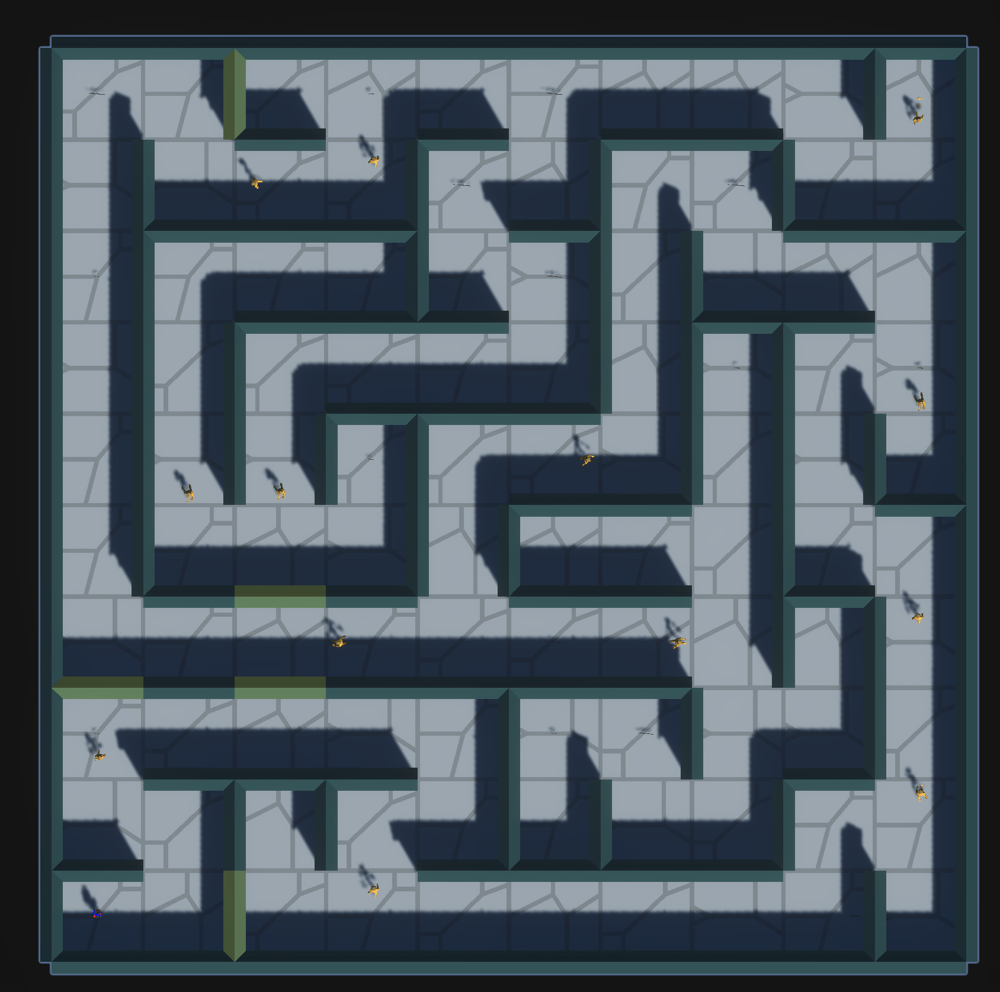

# MapGenerator for Unity

A robust, customizable procedural maze generator for Unity that creates playable maze levels with collectibles, enemies, and interactive elements.



## 🎮 Features

- **Procedural Maze Generation**: Creates unique mazes every time using depth-first search algorithm
- **Customizable Terrain Sets**: Support for multiple theme sets with different visual styles
- **Dynamic Elements**:
  - Collectible items
  - Breakable walls (with smart placement to avoid L/T shapes)
  - Decorative elements
  - Enemy patrol paths (straight and L-shaped)
- **Player & Endpoint Spawning**: Automatic placement at start and finish positions
- **Unity-Ready**: Easy to integrate into any Unity project

## 📋 Requirements

- **Unity Version**: Tested on Unity 2022.3+ (should work on 2019.4+ with minimal changes)
- **Required Components**:
  - StarterAssets package (for player controller - can be replaced with your own)
  - Basic understanding of Unity prefabs and component system
- **Scripts Required**:
  - Collectible.cs (simple MonoBehaviour for collectible items)
  - BreakableWall.cs (MonoBehaviour for walls that can be destroyed)
  - EnemyController.cs (Script for handling enemy movement)

## 🛠️ Installation

1. **Import Assets**:
   - Copy the MapGenerator.cs script into your project's Scripts folder
   - Create folders for your wall, floor, and decoration prefabs

2. **Prepare Required Scripts**:
   Create these required script components if you don't have them already (below are some basic examples):

   ```csharp
   // Collectible.cs - Simple script for collectible items
   using UnityEngine;
   
   public class Collectible : MonoBehaviour
   {
       public int value = 1;
       
       private void OnTriggerEnter(Collider other)
       {
           if (other.CompareTag("Player"))
           {
               // Add to player score/inventory
               Debug.Log("Collected item!");
               Destroy(gameObject);
           }
       }
   }
   
   // BreakableWall.cs - Script for walls that can be broken
   using UnityEngine;
   
   public class BreakableWall : MonoBehaviour
   {
       public float health = 100f;
       public GameObject breakEffect; // Optional particle effect
       
       public void Damage(float amount)
       {
           health -= amount;
           if (health <= 0)
           {
               if (breakEffect != null)
                   Instantiate(breakEffect, transform.position, Quaternion.identity);
               Destroy(gameObject);
           }
       }
   }
   
   // Basic EnemyController.cs - For enemy patrolling
   using UnityEngine;
   
   public class EnemyController : MonoBehaviour
   {
       public Transform[] patrolPoints;
       public float moveSpeed = 3f;
       public float waitTime = 1f;
       
       private int currentPointIndex = 0;
       private float waitCounter = 0f;
       private bool waiting = false;
       
       private void Update()
       {
           if (patrolPoints.Length == 0)
               return;
               
           if (waiting)
           {
               waitCounter += Time.deltaTime;
               if (waitCounter >= waitTime)
               {
                   waiting = false;
               }
           }
           else
           {
               Transform targetPoint = patrolPoints[currentPointIndex];
               Vector3 direction = targetPoint.position - transform.position;
               direction.y = 0; // Keep movement on the horizontal plane
               
               if (direction.magnitude < 0.1f)
               {
                   // Reached waypoint
                   waitCounter = 0f;
                   waiting = true;
                   currentPointIndex = (currentPointIndex + 1) % patrolPoints.Length;
               }
               else
               {
                   transform.position += direction.normalized * moveSpeed * Time.deltaTime;
                   transform.rotation = Quaternion.LookRotation(direction);
               }
           }
       }
   }
   ```

## 🚀 Usage

1. **Create a new GameObject** in your scene and name it "MazeGenerator"
2. **Add the MapGenerator script** to this GameObject
3. **Configure the inspector settings** according to your needs
4. **Create and assign prefabs** for walls, floors, decorations, and other elements
5. **Press Play** to generate and test your maze

## ⚙️ Configuration

The MapGenerator comes with many customizable options in the Inspector:

### Maze Settings
- **Width & Height**: Size of the maze (in cells)
- **Cell Size**: Physical size of each cell (automatically calculated from wall prefabs)

### Terrain Assets
Create at least one TerrainAssets set including:
- **Floor Prefabs**: The ground tiles for each cell
- **Wall Prefabs**: Separate prefabs for north, south, east, and west walls
- **Decoration Prefabs**: Optional decorative elements

### Collectibles & Decorations
- **Collectible Prefabs**: Items the player can pick up
- **Collectible Spawn Chance**: Probability (0-1) of spawning a collectible in each cell
- **Decoration Spawn Chance**: Probability (0-1) of spawning decorations in cells

### Wall Settings
- **Breakable Wall Chance**: Probability (0-1) of a wall being breakable
- **Wall Thickness**: Physical thickness of walls

### Enemy Path Settings
- **Enemy Path Spawn Chance**: Probability (0-1) of generating an enemy path from a cell
- **Debug Draw Paths**: Toggle visibility of enemy paths in the Scene view

### Prefabs
- **Enemy Prefab**: Prefab with EnemyController component
- **Player Prefab**: Your player character prefab
- **Endpoint Prefab**: Object marking the maze exit/win condition

## 🧩 Prefab Setup Guide

### Wall Prefabs
1. Create simple wall meshes (or use primitive cubes scaled appropriately)
2. Ensure they have:
   - A **Mesh Collider** or **Box Collider** component
   - Appropriate material/texture
   - Consistent orientation (North/South walls should face Z-axis, East/West walls should face X-axis)

### Floor Prefabs
1. Create flat meshes for floor tiles
2. Add a **Mesh Collider** or **Box Collider** component (marked as non-trigger)

### Player & Enemy Prefabs
1. Ensure these have appropriate controllers and colliders
2. For enemies, add the **EnemyController** component

## 🔍 How It Works

The maze generation uses a depth-first search algorithm:

1. **Initialization**: Creates a grid of cells with walls between all cells
2. **Maze Carving**: Uses depth-first search with backtracking to remove walls and create paths
3. **Element Placement**:
   - Places floors for all cells
   - Adds walls based on the maze data
   - Spawns collectibles randomly
   - Creates enemy paths ensuring they don't overlap with the player spawn
   - Places decorations near walls
   - Positions player at start (SW corner) and endpoint at finish (NE corner)

Special logic ensures:
- Breakable walls are never placed at corners (L-shapes) or T-junctions
- Enemy paths never start at or pass through the player spawn point
- Decorations are positioned along walls without overlapping collectibles

## 🛠️ Customization Tips

### Adding Custom Terrain Themes
1. Create a new set of prefabs (walls, floors, decorations)
2. In the Inspector, increase the size of the TerrainAssets array
3. Assign your new prefabs to the new element

### Modifying Maze Complexity
- Adjust width and height for larger/smaller mazes
- Modify breakable wall chance for more or less destructible environments

### Extending Functionality
- The script can be extended to spawn different types of enemies
- Add power-ups or special collectibles with unique behaviors
- Implement trap mechanisms or moving obstacles

## 🔧 Troubleshooting

### Common Issues

1. **Walls Appearing Incorrectly**:
   - Ensure wall prefabs are aligned correctly
   - Check that north/south/east/west prefabs are assigned to the correct slots

2. **Enemy Pathing Problems**:
   - Verify EnemyController script is attached to the enemy prefab
   - Check NavMeshAgent component if you're using Unity's navigation system

3. **Performance Issues with Large Mazes**:
   - Consider implementing object pooling for large maze sizes
   - Use LOD (Level of Detail) for complex wall/decoration meshes

### Debug Options

- Enable "Debug Draw Paths" to visualize enemy patrol routes in the Scene view
- Add debug logs in key methods to trace execution flow

## 📝 License

This maze generator is available under the MIT License. See the LICENSE file for more details.

While the core generator code is MIT licensed, please note that you'll need to:
- Create your own art assets (or license them separately)
- Ensure any third-party Unity packages you use with this code have compatible licenses

## Credits

- Original implementation by Xiaotian (Tank) Wang.

---

Happy Maze Building! 🏗️🎮
